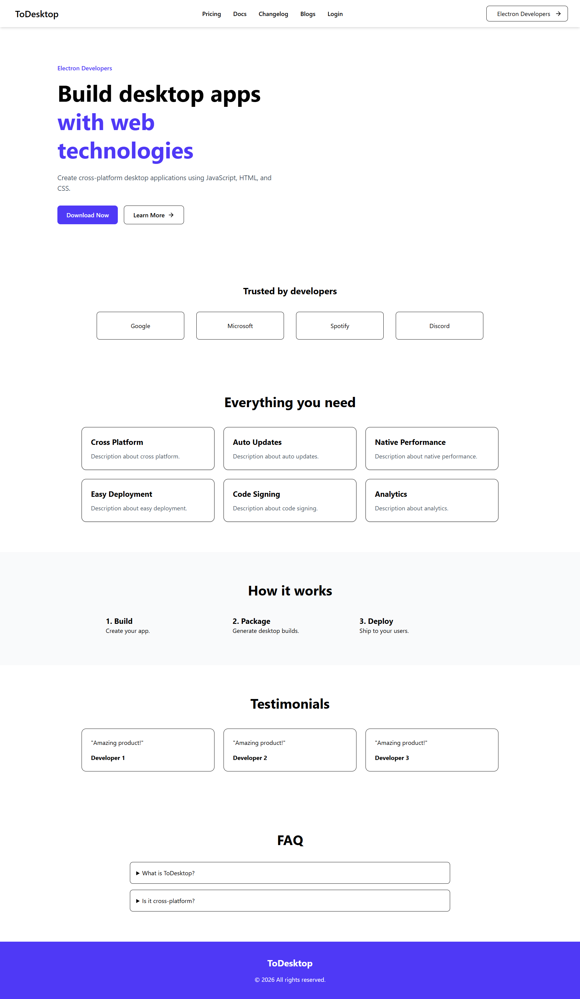

# Modern UI with Tailwind

A responsive landing page built with React and Tailwind CSS.

## Features

- Responsive Navbar
- Hero Section
- Companies Section
- Features Grid
- How It Works Section
- Testimonials
- FAQ Section
- Footer

## Screenshot



## Tech Stack

- React
- Tailwind CSS
- Lucide React

## Installation

```bash
npm install
npm run dev
If you are developing a production application, we recommend using TypeScript with type-aware lint rules enabled. Check out the [TS template](https://github.com/vitejs/vite/tree/main/packages/create-vite/template-react-ts) for information on how to integrate TypeScript and [`typescript-eslint`](https://typescript-eslint.io) in your project.
```
